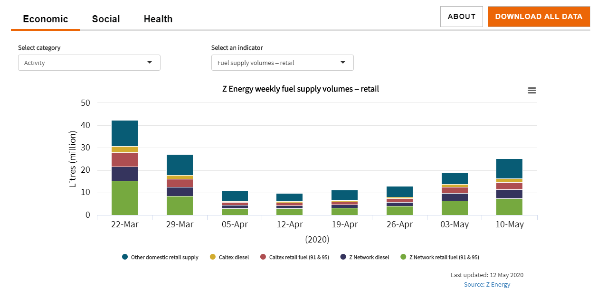
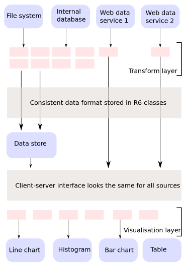

# Data portal

This is a generic data portal written in Shiny R.  It is designed for making the display and management of a large number of disparate data sets simple and easy.

For for documentation, examples and user guide see documentation/documentation.pdf.


---
__Copyright and Licensing__

The package is Crown copyright (c) 2020, Statistics New Zealand on behalf of the New Zealand Government, and is licensed under the MIT License (see LICENSE file).

<br /><a rel="license" href="http://creativecommons.org/licenses/by/4.0/"></a><br />This document is Crown copyright (c) 2020, Statistics New Zealand on behalf of the New Zealand Government, and is licensed under the Creative Commons Attribution 4.0 International License. To view a copy of this license, visit http://creativecommons.org/licenses/by/4.0/ or send a letter to Creative Commons, PO Box 1866, Mountain View, CA 94042, USA.

## Introduction

The publication of a large number of unique data sets in a user friendly visualisation can present a challenging problem.  This is often solved through the production of a specialised *dashboard* for the particular data set and audience.  However, these solutions can become complicated, expensive to maintain and can be difficult to recycle for new data.  This is often because dashboards are built to be highly specific and over-engineered for the given data set, where a desire to show a large number of unique visualisations has limited the the ability to generalise the software for other uses.



The advantage of dashboards over a traditional publishing process is that they enable the user to generate insights based on their needs.  Data sets may come with many regional, industry and social (to name a few) dimensions that are difficult to properly represent through a choice of only a handful of graphs.  There is a need for a solution which enables rapid publication of large numbers of different data sets in a semi-automated but flexible way.

We present here a simple solution for these problems.  This data portal software is a framework for building a range of similar data dissemination tools, with a robust data management process combined with sufficient flexibility to work with a range of data sources and visualisation requirements.

This software is the basis of the COVID-19 Data Portal, which was published on the experimental Stats NZ website in April 2020.  The structure of the code has enabled this portal to grow to holding over 300 different time series from a large range of different input formats.  The code was further generalised into the current state in May 2020 to allow for quick deployment of similar portals.  In the figure below we show the same software used to display environmental data directly from a web based data service.


This documentation describes the data management principles and software.  The intended use of this documentation, and the associated code, is for the reuse of this solution for rapid production of data visualisations.


# The data management process



For this application to be able to scale quickly and be reused for a range of needs there must be a robust and flexible data management process.  In the figure above we show the process map for the various types of data sources and how these flow through the system.

In the figure we show four possible sources of data at the top.  These represent the first steady-state.  The original raw data is read in using either one of the predefined functions, or by writting a custom function if a new source is required (such as a new web service).  For a file this is as simple as pointing to the correct directory, so there is little abstraction required -- but web services or database calls may require specific functions.  This raw data is then passed into the transformation layer.  This layer may contain many custom *load functions* designed to transform raw data into a consistent format.  The output of these load functions must be a type defined in `R/data_types.R`.  If a suitable structure is not available then one can be defined in that file.

Internal data is then passed into the *data store*.  This is simple list containing all the data sets saved into a file on the harddrive.  This file is then deployed with the application.

Finally all data is accessible through the client-service interface.  From the perspective of the client this layer is called in the same way with the same behaviour regardless of the data source, returning one of the expected data types.  This data is then passed through the visualisation layer, where custom plot functions may be defined for alternative visualisations of data.

See below for details on how to build functions for each of the layers in this process.

# Code documentation

This section outlines how to work with data portal software including how to define new visualisations and create custom functions for the data management process.  

## Examples

To get started with the generic data portal code it is good to try the examples.  To run the most basic example:

- Copy the file `config/example/example_config.yaml` into a new file called `config/config.yaml` (this file is not to be kept under version control as it's specific to each portal).
- Run the script `scripts/run_load_process.R` to load the data into an RDS file.
- Run the command `shiny::runApp(".")` to start the application.


This will use the indicator and data definitions defined in 'config/example_indicators.json' and 'config/example_data_definitions.json' to create a visualisation from the data in the 'example_data/' folder.  These can be changed in the 'config/config.yaml' file, see Section 'sec:config_file' for details.  To run a more sophisticated example that uses data purely from a web based service run the application with the following steps.

- Copy the file `config/api_example/api_example_config.yaml` into `config/config.yaml`
- Run the command `shiny::runApp(".")` to start the application.

Note that in this case we did not need to load to an RDS file as all data comes from a web service.

\newpage
\clearpage
\subsection{The configuration file}\label{sec:config_file}

The configuration file is a YAML file of key-value pairs that is loaded in at the start of the application.  This file controls the look and feel of the application and defines the file paths to other configurable parts of the application, along with any other adjustable parameters.  The file must have the path \codeword{config/config.yaml}.  This avoids the need for any definitions in the R code itself, making it easier to maintain and configure.  An example of the configuration file contents in given in the Figure below.

The configuration parameters and meaning are:
\begin{itemize}
\item \codeword{title} - The name to appear in the about and download modals.
\item \codeword{production} - for data coming from files on the file system read from the files at Shiny application start up (if \codeword{false}) otherwise read from the RDS file if (\codeword{true}) (requires running the load data script first to create the RDS file).
\item \codeword{data_directory} - If reading data from the file system what directory are the files stored in (\textit{optional}).
\item \codeword{indicator_definitions} - file path to the indicator definitions JSON file (see Section \ref{sec:indicator_definition}.
\item \codeword{data_definitions} - file path to the data definitions JSON file (see Section \ref{sec:data_definition} (\textit{optional}).
\item \codeword{default_parameters} - a list of default parameters to use if these are not found when looking in the indicator or data definition files (\textit{optional}).
\item \codeword{primary_color} - the brand color for the application.
\item \codeword{data_store_filename} - the RDS file for storing data from the file system (used for both reading and writing) (\textit{optional}).
\item \codeword{about_modal_html} - HTML file for the content to appear in the about modal.
\item \codeword{download_modal_html} - HTML file for the content to appear in the download modal.
\item \codeword{tag_manager_html} - HTML file containing the Google Analytics tag manager code (\textit{optional}).
\end{itemize}

```
title: "COVID-19"
production: true
data_directory:  "~/COVID-19 data_Secure/COVID-19_dashboard/"
indicator_definitions: "config/covid_19/covid_19_indicators.json"
data_definitions: "config/covid_19/covid_19_data_definitions.json"
default_parameters:
  data_type: "TimeSeries"
  plot_function: "get_time_series_plot"
  data_service: "load_from_store"
primary_color: "#EC6607"
data_store_filename: "data_store.RDS"
about_modal_html: "www/about_covid_19.html"
download_modal_html: "www/download_modal_covid_19.html"
tag_manager_html: "www/tag_manager.html"
```
Example configuration file.  This file controls the overall appearance of the application and defines the location of various other files which are specific to the particular product.

## Defining indicators

Indicators are defined in a JSON format configuration file.  For each indicator a block of JSON defines all properties such as the title, labels, the source of the data and any additional parameters required to request that data.

All visualisations (each chart of graph) in the application must have a unique key, which is a concatenation of

- The \codeword{class}
- The \codeword{type}
- The \codeword{indicator_name}
- The \codeword{name} parameter of the group

These parameters are defined in the corresponding JSON, with an example given below.  These four parameters will uniquely define the tab selected, the three choices of the drop down selectors at the top of the page and as a result a data source and a visualisation.

The possible parameters for an indicator definition are:

- class -- The tab the indicator will appear on.
- type -- The first drop down selector.
- indicator_name -- The second drop down selector.
- title -- the title to appear on the graph.
- source -- the name of the data source.
- source_url -- the URL for the data source.
- plot_function -- the name of the plot function.
- international -- \codeword{true} or \codeword{false} will determine grouping in indicator list.
- download --  \codeword{true} to include this indicator in the download CSV file.
- data_service -- the data service to use to fetch the data.
- include_date_slider -- \codeword{true} to include a data slider.
- default_lower_range -- the lower date range in the format ``YYYY-MM-DD''.
- caveats -- HTML or text for contents of caveat box (text block below graph with orange border).
- description --  HTML or text for contents of description box (text block below graph).
- groups -- an array of JSON blocks with the following parameters:

- name -- the option in the third drop down box.
- title -- the title (if different to above).
- units -- the units to appear on the y-axis label.
- data_service -- the data service (if different to above).
- caveats -- caveats text or HTML (if different to above).
- description -- description text or HTML (if different to above).

Parameters defined in the indicator definition are generally returned using the function `get_indicator_parameter`.  This function will first check the `group` block of parameters for the required parameter, and if it is not found, will use the value at the indicator level.  This allows for specific parameters to be applied at the group level when necessary.

```
  {
    "class": "Economic",
    "type": "Transport",
    "indicator_name": "Flight departures by main airports",
    "source": "Flightradar24",
    "plot_function": "get_time_series_plot",
    "international": false,
    "source_url": "https://www.flightradar24.com/data/statistics",
    "download": false,
    "groups": [
      {
        "name": "Auckland Airport",
        "title": "Daily departures - Auckland Airport",
        "units": "Number"
      },
      {
        "name": "Wellington Airport",
        "title": "Daily departures - Wellington Airport",
        "units": "Number"
      }
    ]
  }
```
